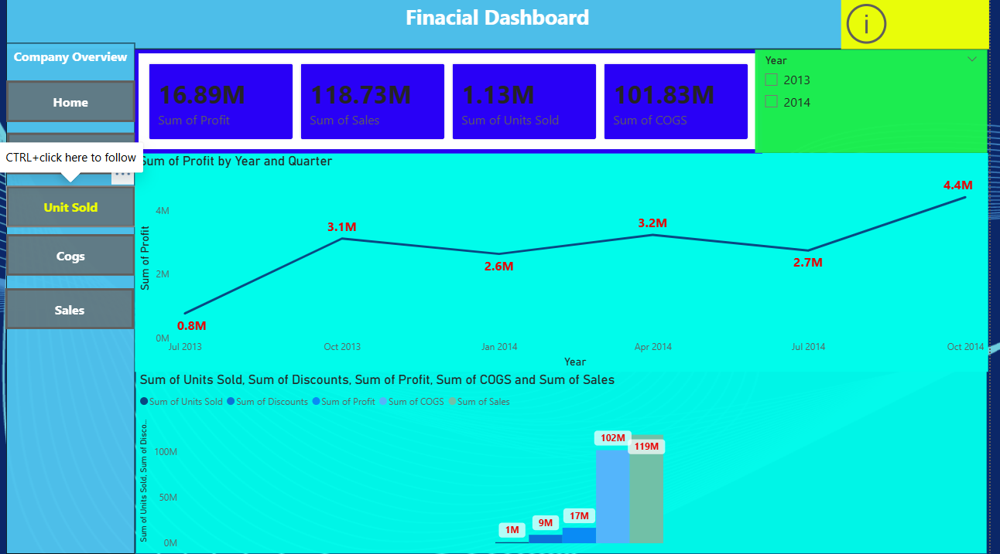

# 📈 Power-BI-Analytics
Portfolio

This repository contains a comprehensive Business Intelligence project developed in Power BI, transforming raw sales and financial data into interactive, actionable dashboards.

## 🚀 Project Overview
This project solves a series of complex business requirements—ranging from year-over-year financial growth analysis to geographical profit tracking—using the **Global Superstore** and **Finance** datasets.

---

## 🖼️ Dashboard Previews
> **Note:** Below are snapshots of the interactive reports. (Ensure you have uploaded your screenshots to an `Images` folder in this repository for these to appear).

### 1. Finance Executive Summary

---

## 🛠️ Key Technical Features

### 1. Advanced DAX Measures
Created custom measures to track business health, including:
* **Year-over-Year (YoY) Growth %:** Comparing current sales performance against the previous year.
* **Profit Indicators:** Logical DAX to identify profitable vs. loss-making segments.

### 2. Interactive Data Storytelling
* **Waterfall Charts:** Implemented to show category-wise variance and yearly revenue shifts.
* **Bookmarks & Navigation:** Created a seamless user experience allowing users to toggle views between **Year, Quarter, and Month**.
* **Drill-Throughs:** Enabled deep-dive analysis (e.g., clicking on a Region to see specific state-level data).

### 3. Data Modeling & ETL
* **Star Schema:** Built a robust data model connecting the Sales, Finance, and User datasets.
* **Power Query (M):** Used for data cleaning, type conversion, and merging box office data to create a master reference table.

### 4. Conditional Formatting
* **Dynamic Visuals:** Applied background color scales (Red-to-Green) for Sales performance.
* **Icon Indicators:** Used status arrows (Red/Green) to represent profit margins.
* **Data Bars:** Integrated directly into tables for quick visual comparison of quantities.

---

## 📂 Repository Structure
* **Reports/:** Contains the main `.pbix` file (`Sales_Dashboard.pbix`).
* **Data/:** The raw datasets used (`sample_-_superstore.xlsx`, `Finance dataset.xlsx`).
* **Documentation/:** The original assignment brief (`Power BI Assignment-Question.docx`).
* **Images/:** Screenshots used in this README.

---

## 💡 Business Insights
* **Top Performers:** Identified high-growth categories using Waterfall analysis.
* **Regional Trends:** Discovered that the West region consistently maintains the highest profit margins despite lower volume in certain sub-categories.
* **Operational Efficiency:** Pinpointed the most cost-effective shipment modes using custom KPI cards.

---
### How to View
1. Download the `Sales_Dashboard.pbix` file.
2. Open it using [Power BI Desktop](https://powerbi.microsoft.com/desktop/).
